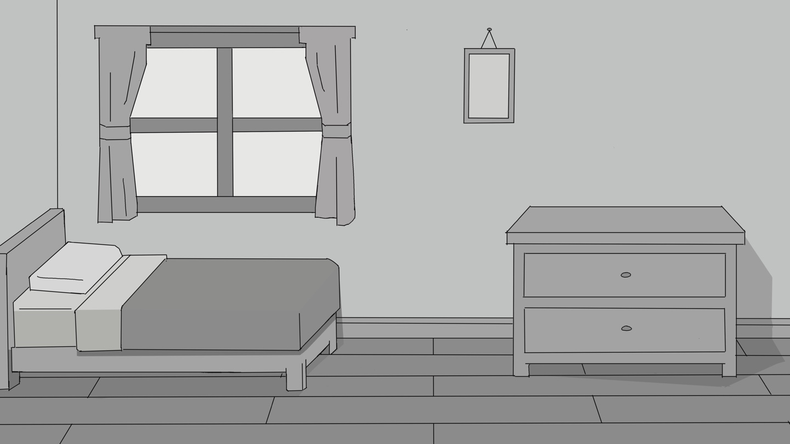
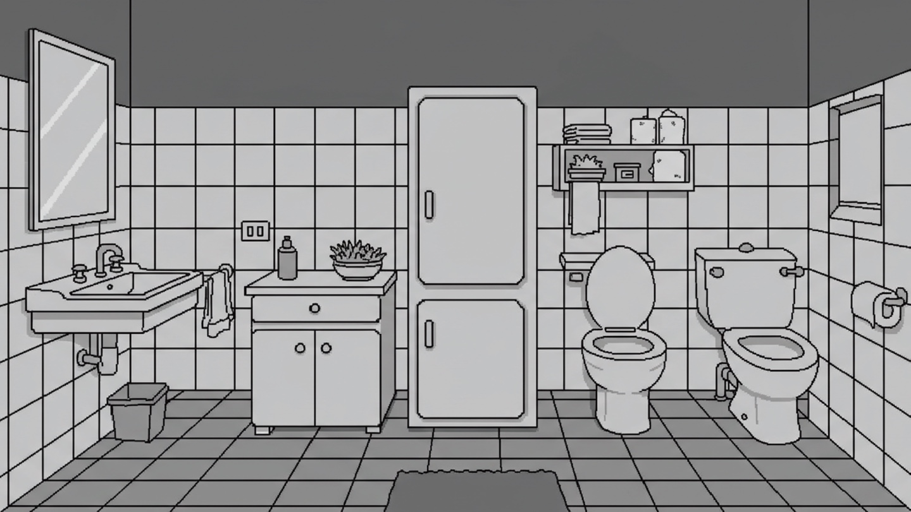
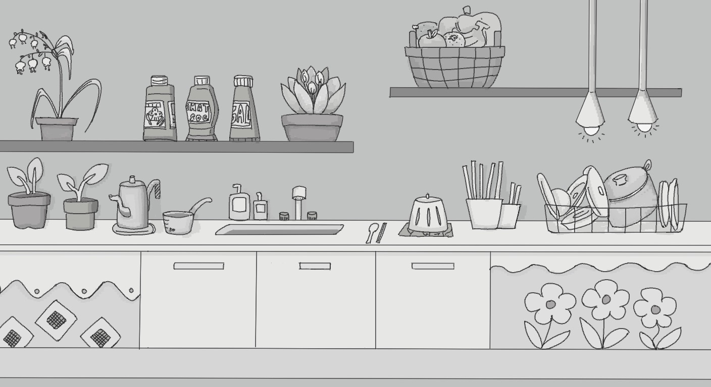
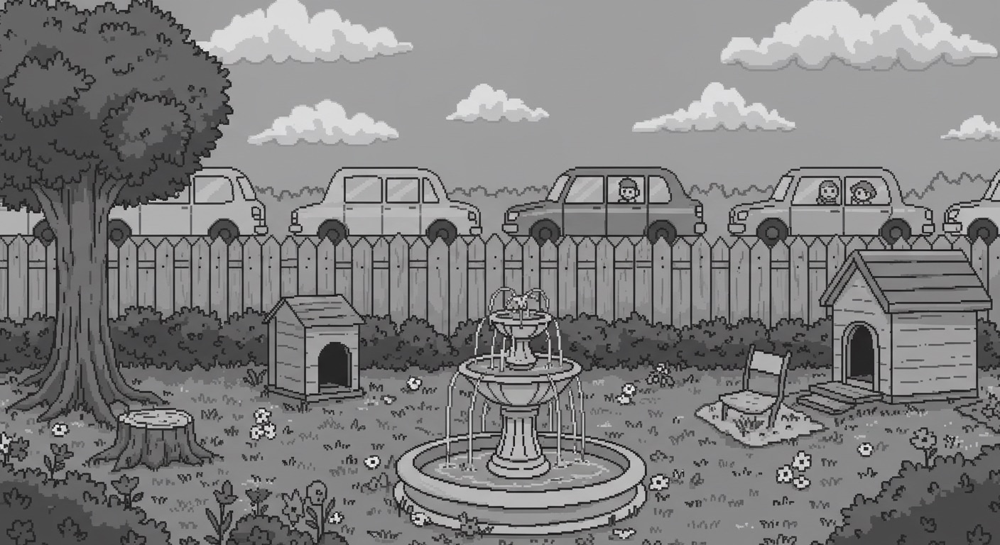
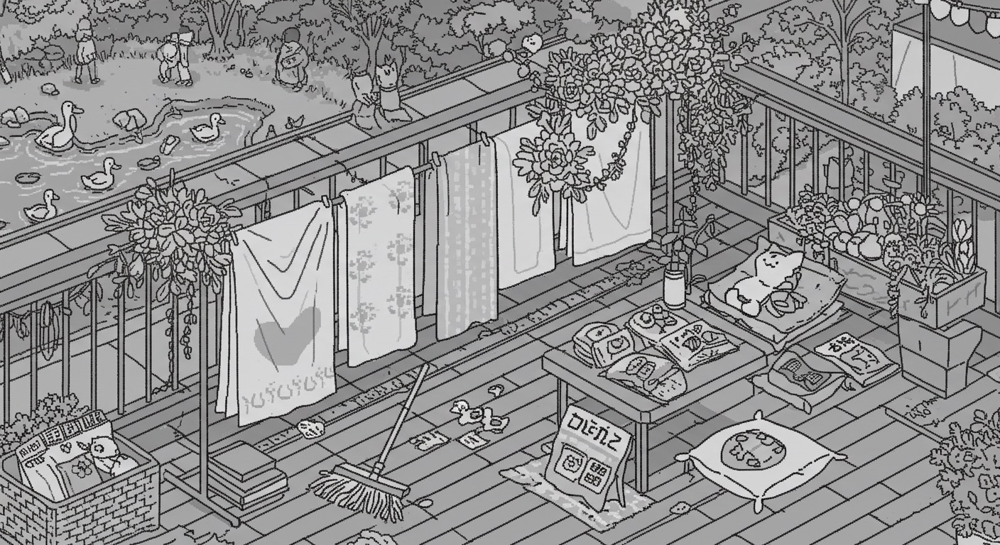

# 고양이 33마리의 유변학

## 목차
- [개요](#개요)
- [게임 화면](#게임-화면)
- [시놉시스](#시놉시스)
- [게임 목표](#게임-목표)
- [게임 플레이 방식](#게임-플레이-방식)

  

## 개요
- 게임 장르 : 2D 숨은그림찾기 게임
- 개발 엔진 및 언어 : Unity, C#
- 플랫폼 : Web
- 개발 기간 : 2025.05.04-2025.05.13
  
  |팀원 소개|-|
  |:--|:-:|
  |기획|손재윤, 이수진|
  |프로그래밍|김가영, 손재윤, 차서연|
  |아트|김연진, 박지인, 정윤서|

  

## 게임 화면
|스테이지 1|스테이지 2|
|-|-|
|||

|스테이지 3|스테이지 4|
|-|-|
|||

|스테이지 5|스테이지 6|
|-|-|
|||

  

## 시놉시스
<i>주인공은 아주 유연한 고양이 3마리를 키우고 있었다. 
잘 기르다 보니 33마리로 불어난 고양이들. 
어느날 집에 돌아와보니 고양이가 단 한 마리도 없었고… 
#### 고양이가 다 어디로 갔을까!?</i>

  

## 게임 목표
1. 고양이를 전부 다 찾아서 모든 스테이지 클리어 
2. 시간 안에 더 많은 고양이를 찾는 사람이 우승 (만약 동점자가 있다면 걸린 시간으로 판별)

  

## 게임 플레이 방식
포인트 앤 클릭, 터치
